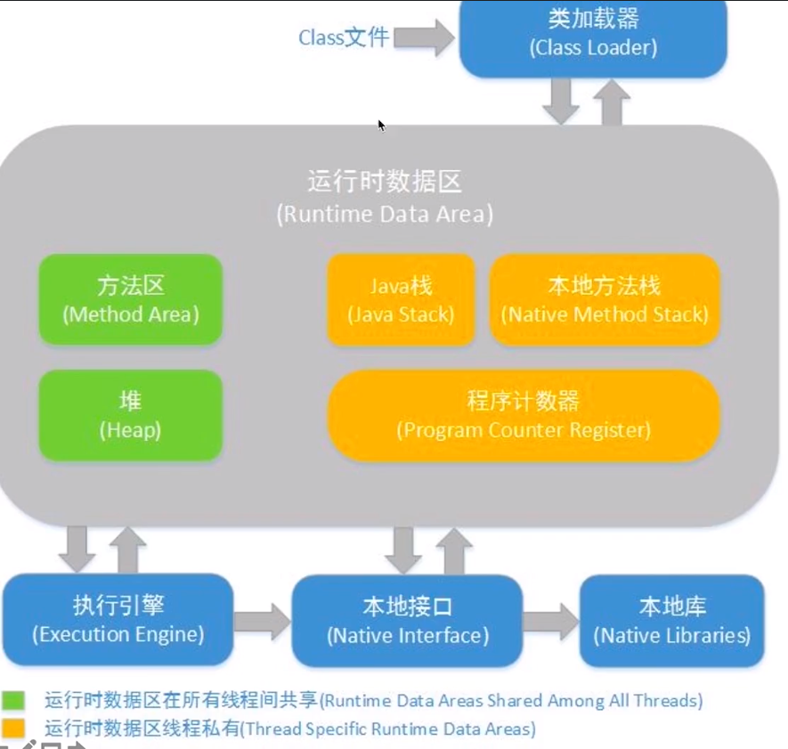
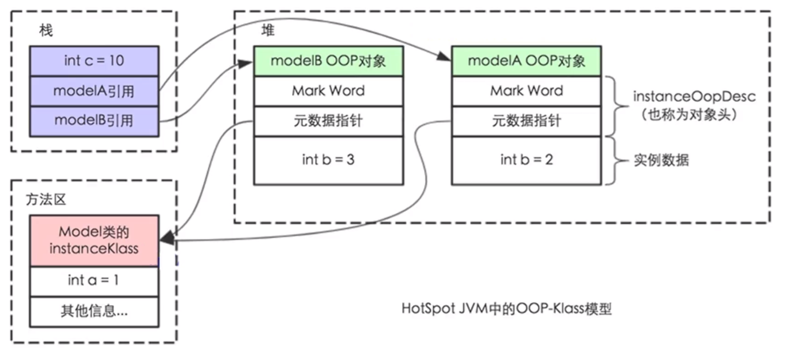
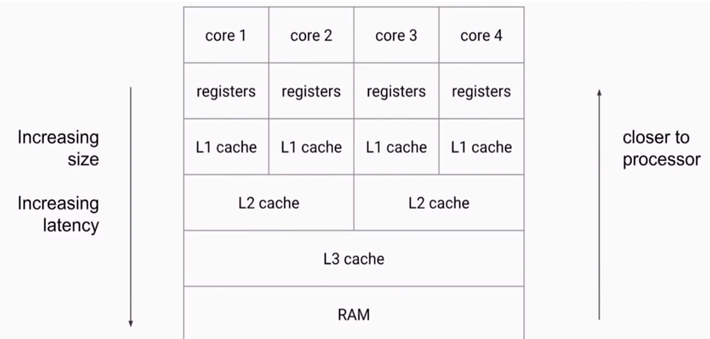
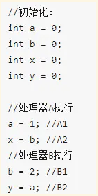

JMM:
1. JVM内存结构，JMM与Java对象模型的区别:
    - 
    - 
    - JMM: Java Memory Model, Java内存模型，是一种规范，
    用来保证程序并发安全
    
2. JMM的三个特性:
    - 重排序
    - 可见性
    - 原子性
    
3. 重排序:
    - 代码编写之后，在执行时，并不会严格按照编写代码的顺序执行
    - 编译器会帮助我们对代码顺序调整，保证在不影响程序运行结果的情况下，
    代码执行效率更高
    - 在多个线程一起执行时，重排序可能会带来并发安全问题

4. 可见性:

    - 每个CPU内核都拥有自己的内部缓存，在读取时，会率先从此缓存内读取
    - 当多个线程之间拥有共享变量时，一个线程对变量的修改可能没有及时写入主存，
    而另一个线程读取到了错误的数据
    - 一个常见的可见性导致的线程安全问题:
        
    
5. 原子性:
    - 原子集合内的所有操作必须一起成功或一起失败
    
6. volatile关键字:
    - 只能加在`field`上
    - 当变量值变化时，会强制将其刷回主存，保证可见性(底层通过加内存屏障来实现)
    - 是一个更加轻量的线程安全保证机制，但实用情况相比synchronized也更加受限:
        - 使用volatile变量进行的操作必须是原子操作，才能保证关于该操作的线程安全
    - 作用:
        - 保证可见性
        - 禁止指令重排序优化: 解决单例双重锁乱序问题
        
7. volatile本质:
    - 通过在变量读写前后增加内存栅栏，来保证线程安全
    - 在对volatile变量进行写操作时，会在其后增加写栅栏，保证前面所有操作都执行完成之后
    才会继续往栅栏后的部分执行(并且是会写入主存的)，并且在多个线程之间也会适用
    - 在对volatile变量进行读操作时，会在其前增加读栅栏，保证前面所有操作都执行完成之后
    才会读取volatile的值(并且是从主存中读取的)
    - volatile不适用与a ++，但适用于单例模式双重锁写法的原因就是因为栅栏
    
    